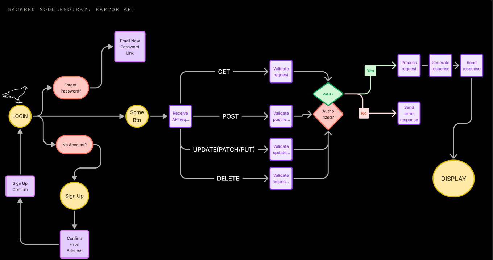

# Building an API for CRUD Operations with birds of prey data

This repository contains the backend for an API managing information about birds of prey. It will allow retrieving bird of prey and falconries data, as well as adding, updating, and deleting entries. Additionally, users can log bird watching observations, and administrators have the ability to manage regional falconries.

## Used Technologies & Libraries:

- Node.js: JavaScript runtime environment for server-side development.
- [Express.js](https://www.npmjs.com/package/express): Fast, minimalist web framework for Node.js.
- MongoDB: NoSQL database for storing bird of prey data, falconries and users.
- [Mongoose](https://www.npmjs.com/package/mongoose): MongoDB object modeling.
- crypto: provides cryptographic functions for Node.js applications, offering capabilities like secure random number generation.
- [Zod](https://www.npmjs.com/package/zod): Schema Declaration and validation library, used it for validation.
- [Jest](https://www.npmjs.com/package/jest): JavaScript testing framework.
- [supertest](https://www.npmjs.com/package/supertest): SuperAgent-driven library for testing HTTP servers.
- [cors](https://www.npmjs.com/package/cors): Express middleware for handling Cross-Origin Resource Sharing.
- [helmet](https://www.npmjs.com/package/helmet): to set secure HTTP headers.
- [bcrypt](https://www.npmjs.com/package/bcrypt): a library to hash passwords.
- [cookie-parser](https://www.npmjs.com/package/cookie-parser): to parse Cookie header and to use them in the req.cookies object.
- [jwt](https://www.npmjs.com/package/jsonwebtoken): to create, sign, verify and decode JSON Web Tokens, enabling authentication and secure data exchange in web-Apps
- [dotenv](https://www.npmjs.com/package/dotenv): loads environment variables from a .env file into process.env, making them accessible
- [nodemailer](https://www.npmjs.com/package/nodemailer): for sending emails
- [axios](https://www.npmjs.com/package/axios): Promise based HTTP client for the browser and node.js
- [Etheral](https://ethereal.email/): a free, fake SMTP service, good for testing E-Mail Services with nodemailer

## Simplified Flowchart

