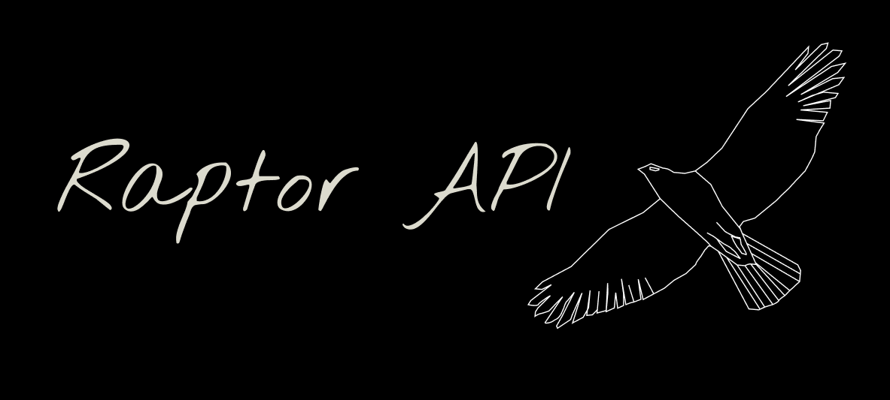

# Building an API for CRUD Operations with birds of prey data

This repository contains the backend for an API managing information about birds of prey. It will allow retrieving bird of prey and falconries data, as well as adding, updating, and deleting entries. Additionally, users can log bird watching observations, and administrators have the ability to manage regional falconries.

## Used Technologies:

- Node.js: JavaScript runtime environment for server-side development.
- Express: Fast, minimalist web framework for Node.js.
- MongoDB: NoSQL database for storing bird of prey data.
- Mongoose: MongoDB object modeling.
- Zod: Schema Declaration and validation library, used it for validation
- Jest: JavaScript testing framework.
- supertest: SuperAgent-driven library for testing HTTP servers.
- cors: Express middleware for handling Cross-Origin Resource Sharing.
- helmet: to set secure HTTP headers
